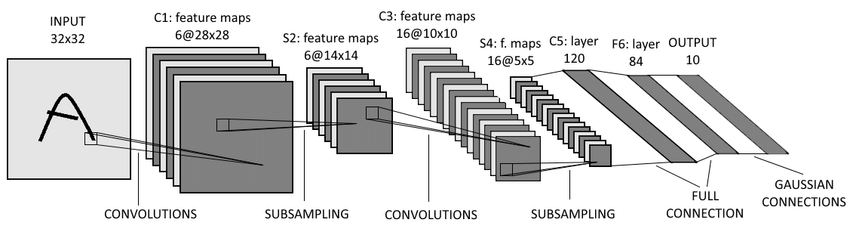

# Convolution Neural Network

### Target
Try to build the wheels of CNN.

## Structure
* Forward: Build mini nn-module (refer to the 'torch.nn') including fundamental functions
           like Conv2d,MaxPool2D,linear and so on.
* Backward: Build mini optimizer to realize BP and use the SGD to train the Network.

* Instantiate: [LeNet-5](http://yann.lecun.com/exdb/publis/pdf/lecun-01a.pdf)
    

## Use Module
* Numpy

## Plan
 [ ] Forward-part
 [ ] Backward-part
 [ ] LeNet-5
