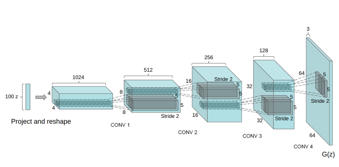
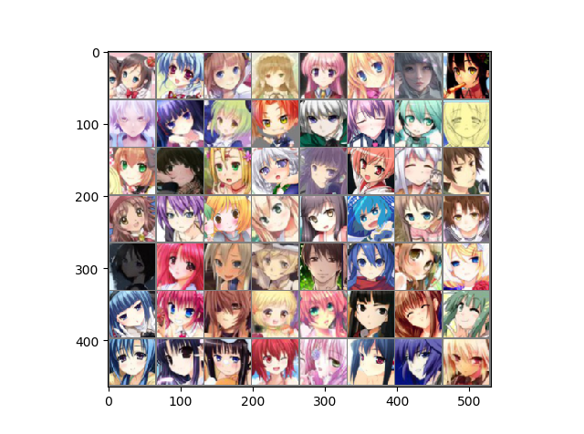
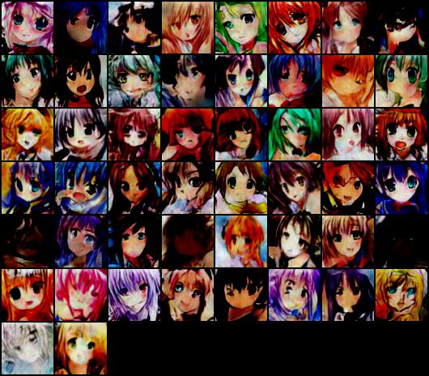
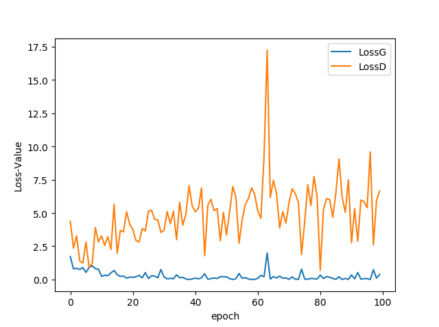

# AnimeFacesGenerate: Use Deep Convolution Generative Adversarial Networks(DCGAN)

## Target
Use [Deep Convolution Generative Adversarial Networks(DCGAN) for Anime-faces Generation](https://arxiv.org/abs/1511.06434).
The structure of the Generator G(z) is like the following:



## Dataset
50,000 Anime-faces pictures of size 96\*96\*3.(would be finally transformed to 64\*64\*3)
* Samples



## Instruments
* pytorch 1.0.1
* matplotlib 2.2.2

## Usage
```
usage: DCGAN.py [--epoch [INT]] [--ngpu [INT]] [--dpath [DIR]] [--opipath [DIR]] [--opapath [DIR]] [--netG [FILE]] [--netD [FILE]]

optional arguments:
    --epoch [INT]           epoches for training,default=10
    --ngpu [INT]            gpu(s) number, default=0(cpu mode)
    --dpath [DIR]           dataset path, default='./'
    --opipath [DIR]         pictures output path, default='./'
    --opapath [DIR]         training parameters output path, default='./'
    --netG [DIR]            pre-trained Generator parameters, default=''
    --netD [DIR]            pre-trained Discriminator parameters, default=''
```

## Result
* Epoch_numbers : 100



* Loss v.s. epoch curve:

